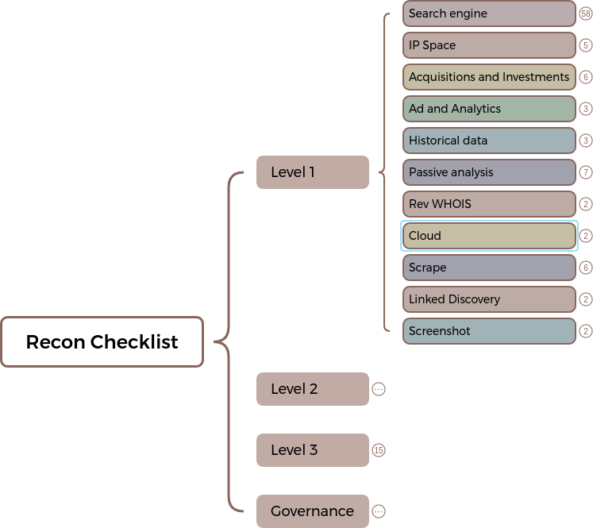
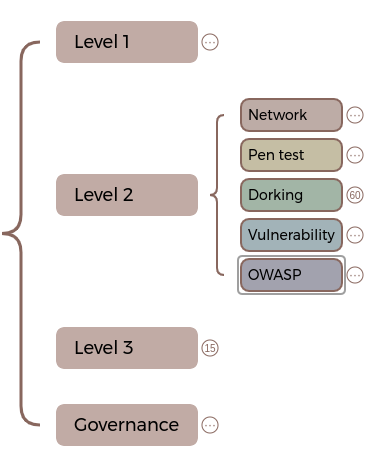
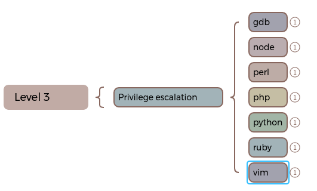
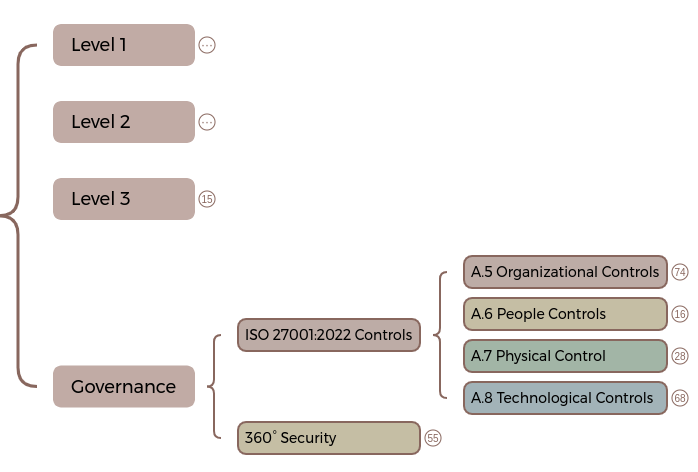

# mind-map
Mind map I use when performing exploratory testing or pre-ISO/SOC validation. 

This mind map has been sanitised, and various sections removed due to sensistive information disclosure and/or undisclosed vulnerabilities. I am keeping this version open source, and free to use. 

## The mind map
The mind map itself has been created using XMind, to view this mind map you will either need to download and install [https://xmind.app/Here](https://xmind.app/) or use their free online cloud-based version [https://xmind.works/](https://xmind.works/).

Alternatevely, you can view the mind map directly [here](https://xmind.works/share/12r6HqZP).

### Level 1
At level, the investigation begins. Ideally, you will be using search engines to find out as much about the target as possible. You might want to find any parent or child companies that relate to the target and begin to form a structural layout of your target. During this phase, you will start to piece together potential IP addresses and DNS servers that can form part of the attack surface.

### Level 2
At this level, you will start a routine penetration test to find vulnerabilities in any of the assets that you identify. This phase will reveal further assets that are of interest. During this phase you will start to identify potential weaknesses and attempt to exploit them.

### Level 3
This phase concentrates on escalation of privileges and lateral movement.

### Governance
This level is aimed at governance, which includes but is not limited to ISO 27001, NIST, SOC and the OWASP Top 10

